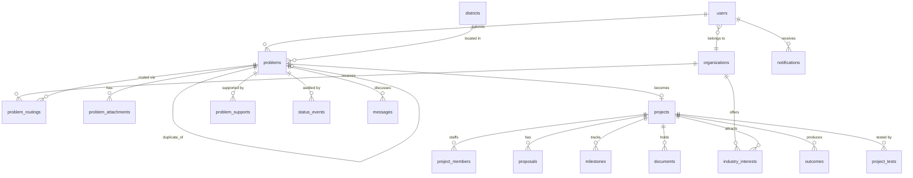

# Architecture

Why each of these choices was made — and what was turned down — is in
[`docs/adr/`](adr/README.md). How to add to it is in [`CONTRIBUTING.md`](../CONTRIBUTING.md).

## Why this stack

The brief asked for a genuinely free tier with a non-destructive upgrade path, first-class
TypeScript, a good fit for seven-role RBAC, and low operational overhead for a small team.

### Neon Postgres + Drizzle ORM + Clerk

**Convex was the serious runner-up.** Its reactive queries would have delivered the
notification centre almost for free, and its function-only access path is a strong security
boundary. It lost on two points:

1. **The analytics dashboard is a headline feature.** District heatmaps, domain distribution,
   time-series trends and completion funnels are one `GROUP BY` each in Postgres. In a document
   store each is a hand-rolled aggregation or a maintained counter table that drifts from
   reality.
2. **Data portability is a procurement question.** For a Government of Jharkhand initiative,
   "the data layer is standard Postgres, movable to NIC or a State Data Centre with `pg_dump`"
   is an answer a proprietary data model cannot give.

**Clerk for identity, Akhra for authority.** Sign-in is delegated to Clerk because:

- **Email that works without a domain.** Clerk sends its own sign-up codes, new-device checks,
  password resets and invitations on its free plan. Nothing to verify, nothing to configure.
- **Less security surface we own.** Password hashing, breached-password checks, code expiry and
  attempt limits, sign-in rate limiting, session cookies and Google sign-in are Clerk's job.
  Akhra's own auth code shrank to linking and invitations.
- **The setup cost is small.** A fresh clone needs two free development keys (or one
  `npx clerk@latest init`) before it boots. Demo personas are created once per development
  instance by `pnpm clerk:demo-users`, not on every reset.

What Clerk does **not** decide: roles, organisations, invitations and suspension stay in Akhra's
`users` table, behind the same API checks and row-level security. Clerk says _who_ someone is;
Akhra says _what they may do_. The costs, stated plainly: a second system with a monthly-user
allowance on the free plan, SMS codes only on a paid plan (not used), and development-instance
users do not carry over to a production instance.

**One database driver.** `node-postgres` speaks plain TCP Postgres, which Neon's pooled
endpoint, a local Docker container, and any future state-hosted instance all support. There is
no Neon-specific code anywhere in this repository.

### What changes in production (configuration, not code)

| Setting               | Development                                      | Production                                     |
| --------------------- | ------------------------------------------------ | ---------------------------------------------- |
| `DATABASE_URL`        | Local Docker or a Neon dev branch                | Neon production branch, or any Postgres        |
| `NEXT_PUBLIC_APP_URL` | `http://localhost:3000`                          | The deployed origin                            |
| `FILE_STORAGE_DRIVER` | `local` (disk)                                   | `blob` (serverless disks are ephemeral)        |
| Clerk keys            | A development instance (`pk_test_` / `sk_test_`) | A production instance, plus the webhook secret |
| `MAIL_DRIVER`         | `console` (stdout)                               | `resend`                                       |
| `ALLOW_SEED`          | `true`                                           | `false` — and the script refuses regardless    |
| `LOG_LEVEL`           | `debug`                                          | `info`                                         |
| AI keys               | Optional; falls to TF-IDF                        | Set for higher classification quality          |

No source file changes. Boot-time warnings fire for combinations that are legal but probably
wrong in production — `MAIL_DRIVER=console` in production, for example.

---

## Module boundaries

Eight modules live in `apps/web/src/modules/`: `citizen`, `classification`, `university`,
`industry`, `lifecycle`, `analytics`, `notifications` and `auth`. Each exposes its public API from
`index.ts`; writes live in service files and reads in query files, and each service function checks
its own authorization.

**The rule: a module may only be imported through its `index.ts`.** Enforced by a
`no-restricted-imports` ESLint rule, so a boundary violation fails CI rather than depending on
review. Full detail in [`apps/web/src/modules/README.md`](../apps/web/src/modules/README.md).

```
citizen ──────► classification ──────► university ──────► industry
   │                  │                     │                │
   └──────────────────┴─────► lifecycle ◄───┴────────────────┘
                                  │
                    analytics ◄───┴───► notifications
```

Dependencies flow in one direction where possible. When two modules genuinely need each other,
the shared concept belongs in `packages/shared` — that is the signal to extract it.

---

## Data model

26 tables. The full schema is in `packages/db/src/schema/`, split into `core` (districts,
organisations, users), `access` (invitations and the audit log), `problems`, `projects` and
`engagement`.



Three decisions worth knowing:

**`status_events` is the audit spine.** Every lifecycle change on any entity appends one row.
The citizen tracker, notification triggers and the analytics funnel all read from this single
table, so there is one source of truth for "what happened to my problem".

**`problems.submitter_id` is nullable.** Anonymous reporting with only a name and phone number
is a real rural requirement. The reference code (`AKH-2026-000123`) plus a phone number is what
enables tracking.

**`email_outbox` persists every message before sending,** so the console driver in development
and the Resend driver in production share one path. The console driver records messages as
`logged`, never `sent`. Sign-in emails are Clerk's; this path carries notifications and the one
invitation Clerk cannot send (to an address that already has an account).

**Counters are derived.** `problems.support_count` and `priority_score` are recomputed from
`problem_supports`, merged duplicates and the report's own fields, never incremented, so a retry or a
race can only correct them.

### The status machine

A report takes one of two tracks, chosen by the district officer at triage. The track is stored on the
report as `resolution_track`, and the citizen tracker shows the steps of that track only.

**Department track** — most reports. Something is broken and a department has to fix it:

`submitted → validated → assigned → action_taken → closed`

**Research track** — a genuine innovation challenge, where no off-the-shelf fix exists:

`submitted → validated → routed → in_progress → prototyped → piloted → deployed → closed`

Plus `rejected`, `duplicate` and `on_hold` off to the side. A district officer can also close a routine
report straight from `submitted` or `validated` ("resolve locally"), with a note the reporter sees.

Defined **once** in `packages/shared/src/status-machine.ts` as a table of
`{ from → to: allowedRoles[] }`. The API guard, the UI (deciding which buttons to render) and
the unit tests all read the same structure, so an illegal transition is inexpressible rather
than merely discouraged.

### Deadlines, after CPGRAMS

`packages/shared/src/service-levels.ts` holds the clock, modelled on the central government's
grievance standard (21 days to dispose, an interim reply if it will take longer, 30 days to appeal):

| Stage          | Limit    | What happens when it passes                                                 |
| -------------- | -------- | --------------------------------------------------------------------------- |
| Triage         | 72 hours | The report is escalated to the state desk and shown as waiting in the queue |
| Department fix | 21 days  | The department and the district officer are both told it is overdue         |
| Interim update | 14 days  | The department is asked to record progress so far                           |
| Reopen window  | 30 days  | The report closes on its own if the reporter never answers                  |

### The reporter has the last word

When a department records what it did, the report does not close. It moves to `action_taken`, and the
person who reported it sees the note on the tracking page with two choices: confirm it is fixed, which
closes it, or reopen it once with a reason, which sends it back to the same department with a fresh
21-day clock. A signed-in reporter is matched by their account; an anonymous one by the reference code
plus the last four digits of the mobile number on the report, the way a grievance number and mobile
work on a government portal.

---

## Who may act on a report

Three government roles, deliberately separated so that no one can both direct work and mark it done.

| Role                                                                    | Appointed by                                                | Confined to                           | Can                                                                                              |
| ----------------------------------------------------------------------- | ----------------------------------------------------------- | ------------------------------------- | ------------------------------------------------------------------------------------------------ |
| `super_admin`                                                           | Bootstrapped once, then promoted by another `super_admin`   | Nothing                               | Everything, including appointing officers                                                        |
| `gov_admin` — a District Grievance Redressal Officer, or the state desk | A `super_admin`, by invitation carrying an explicit scope   | One district, or the whole state      | Validate, reject, merge, assign to a department, route to a university, move to another district |
| `dept_officer`                                                          | A `super_admin`, by invitation carrying an `organizationId` | One department, across every district | Record what the department did — nothing else                                                    |

The rules that hold this in place:

- Scope is an **explicit choice on the invitation**: one district, or the whole state. It is never
  inferred from a blank field, because the most powerful account below a super administrator should
  never be the result of a form somebody forgot to fill in. The invitation also records the
  **designation** the officer holds, the way a CPGRAMS proforma does.
- A district is set **when the invitation is issued** and is never writable by the account holder.
  `updateOwnProfile` writes only name, phone, home district and locality; a database trigger
  (`akhra_guard_access_columns`, migration `0016`) additionally refuses any change to `role`,
  `jurisdiction_code`, `organization_id` or `status` made through the `akhra_app` role, which is
  the role every request-scoped query runs as.
- A district officer has **no** `organization_id` — a check constraint enforces it. The officer who
  assigns work is therefore never a member of the department that does it.
- A department officer **must** have an `organization_id`, and can never hold a district.

A citizen's own district is not an access control. It is a convenience: it pre-fills the report
form. The district that matters is the one on the **report**, because that is where the problem is —
someone may report a broken culvert in a district they were only passing through. A report filed
under the wrong district is **moved, never rejected**, which is what
[DARPG's 2024 CPGRAMS guidelines](https://www.pib.gov.in/PressReleasePage.aspx?PRID=2226247&reg=3&lang=1)
require: a grievance that does not belong to you is transferred to the authority it does belong to.
`transferDistrict` records the move on the public timeline, notifies the receiving district's
officer, clears the now-meaningless locality, and allows at most two moves so a report cannot be
passed around indefinitely.

## RBAC — two layers, described accurately

**Layer 1, the API, is the enforcement path.** Every route handler and server action starts with
`requireRole()` or `requireActor()` from `apps/web/src/server/session.ts`; the module's service then
checks ownership and scope through `assertCanAct` — a district for a `gov_admin`, the assigned
department for a `dept_officer`.

**Layer 2, the database, is defence in depth.** Postgres row-level security policies on
`problems`, `projects`, `documents`, `messages`, `notifications` and `industry_interests`.
Request-scoped queries run through `withUserContext(db, ctx, fn)` in
`packages/db/src/client.ts`, which opens a transaction, switches to the restricted `akhra_app`
role with `SET LOCAL ROLE`, and sets `akhra.user_id` and `akhra.role` as session variables the
policies read.

Making this actually enforce took three steps, each found by a test that tries to read data it
should not (`packages/db/tests/rls.test.ts`):

1. Postgres exempts a table's owner from its own policies, so every protected table has
   `FORCE ROW LEVEL SECURITY` (migration `0002`).
2. Superusers bypass RLS even when it is forced — and a local Docker Postgres user _is_ a
   superuser, while a managed one is not. Left there, Layer 2 would have silently vanished in
   development while working in production: the worst kind of divergence, because it hides.
3. So the application drops to `akhra_app` (migration `0003`), a role that owns nothing and is
   not a superuser. `SET LOCAL` reverts on commit, so one connection string still serves the
   app, migrations and seeding. Owner-run scripts escape deliberately through `withoutRls`,
   which issues `SET LOCAL row_security = off` — a statement the app role cannot issue.

The district boundary lives in these policies too, not only in TypeScript (migrations `0016` and
`0017`). `akhra_handles_problem(district_code, assigned_org_id)` returns true for a `super_admin`,
for a `gov_admin` whose `jurisdiction_code` is blank or matches the report's district, and for a
`dept_officer` whose organisation the report is assigned to. A Deoghar officer cannot read a Ranchi
row even through a query that forgot its filter.

`problems_update` carries a separate `WITH CHECK`, because _which rows you may touch_ and _what a
row may become_ are different questions. A district officer may only reach rows in their district
(`USING`), but the row they write may land in another district (`WITH CHECK`) — that is exactly a
transfer. A department officer, by contrast, may not move a report to a different department.

Files add one more gate: `/api/files` serves nothing by its key alone. A report's attachment goes
only to the people listed under _Report files are never public_ below, a project document only to
people who can see its row, and every upload must match its real file signature, not just the type
the browser declared.

Layer 2 exists to contain a bug in Layer 1, not to replace it. Calling this "zero-trust RLS"
would overstate it; the accurate description is a backstop, and an accurate description is more
useful to whoever maintains this next.

---

## Access: closed and invite-only

Anyone can create a **citizen** account, and nothing else. Universities, industry partners and
government officers get accounts only through a signed invitation, issued after an offline
relationship (an MOU or empanelment) exists.

| Role                                  | Rank | Organisation             | May invite                                   |
| ------------------------------------- | ---- | ------------------------ | -------------------------------------------- |
| `super_admin`                         | 100  | none                     | first admins of an organisation, `gov_admin` |
| `gov_admin`, state-level              | 80   | government               | nobody                                       |
| `gov_admin`, district officer         | 80   | government, one district | nobody                                       |
| `university_admin` / `industry_admin` | 60   | their own                | their own org's roles, never above their own |
| `faculty` / `industry_partner`        | 40   | their own                | nobody                                       |
| `student`                             | 20   | their institution        | nobody                                       |
| `citizen`                             | 10   | none                     | nobody (self sign-up only)                   |

`canIssueInvite()` in `packages/shared/src/roles.ts` is the single rule: rank of the invited role
at most the inviter's, same organisation, a role that belongs to that organisation's type, and
never `super_admin`.

**Invitation tokens** are `<inviteId>.<secret>.<HMAC-SHA256 over both, keyed by
INVITE_SIGNING_SECRET>`. The database stores only `sha256(secret)`, so a leaked table yields no
usable links. Clerk emails the invitation, pointing at `/invite/<token>` with a Clerk sign-up
ticket attached, so the invitee sets a name and password without a second email check. If the
address already has an account, Clerk declines and Akhra's own mailer sends the link instead;
that person signs in and accepts. Accepting requires being signed in with a verified email equal
to the invited one, then checks the signature, the stored hash (constant-time), revocation, single
use and expiry, each with its own error code and each refusal audited. Re-issuing or revoking an
invite also revokes Clerk's copy, so an old email cannot be used.

**Linking a Clerk account to an Akhra row.** On each request the Clerk user id is looked up in
`users.clerk_user_id`. The first time, Akhra asks Clerk for that person's email, and only a
**verified** email counts:

- an Akhra row with that email and no link is claimed, keeping its role. This is how a
  bootstrapped super admin, a seeded persona or a pre-created row becomes someone's account;
- a row already linked to a different Clerk user is never taken over;
- the database itself refuses a university, faculty, student or industry role without an organisation
  (`users_org_role_needs_org`), so no path, old or new, can leave one floating;
- otherwise a new **citizen** row is created. Nothing a person types can produce any other role.

The Clerk webhook (`/api/webhooks/clerk`, signature-checked) applies the same linking on
`user.created`, keeps the email in step on `user.updated` (refusing one that belongs to another
account), and suspends and unlinks the row on `user.deleted`.

**The first super admin** comes only from `pnpm admin:bootstrap`, which refuses to run if one
already exists. It promotes an existing account with that email, or else writes an unlinked
`super_admin` row that the person claims by creating their account with the same email. Later super admins come only from an existing super admin promoting
a `gov_admin`. A test greps the app source to prove no route, action or page writes the role
anywhere else.

**Status is re-read on every request,** so a suspension or demotion takes effect on the next
click, whatever the Clerk session says. The sign-in form gives one message for an unknown email
and a wrong password, and password reset moves to the code step for any address, so neither
reveals whether an account exists.

Every onboarding, issuance, redemption, rejected redemption, revocation and promotion writes an
`audit_events` row, readable only by the super admin.

**District officers** are `gov_admin` accounts with a `users.jurisdiction_code`: one district each,
set only through an invitation a super admin scopes to that district (`invites.jurisdiction_code`),
and allowed by a database check only on `gov_admin` rows. A blank code means a state-level officer.
The session actor carries the code, and the classification service checks it before any decision:
a district officer's validation queue, decisions (validate, reject, merge, resolve), routing and
dashboard figures cover their own district only; anything else is `FORBIDDEN`. "Resolve locally"
closes a routine report directly (`submitted`/`validated` → `closed`) with a required note the
reporter sees. Only validated reports can be routed to a university. State-level officers and the
super admin see every district.

**Report files are never public.** Photos, videos and documents attached to a report are served
only by `/api/files`, which checks on every request that the viewer is the reporter, the person who
uploaded the file, the report's own district officer, a state-level officer or the super admin, or a
member of the university the report was routed to or whose project it became. Anyone else, signed
in or not, gets a 404. The public tracker does not list files. Project documents follow the project
team's own rule. Both storage drivers are read through this route; clients never see a storage URL.

## What runs on a schedule

The scheduled jobs run from one endpoint, `/api/cron/maintenance`, guarded by `CRON_SECRET` compared in constant
time. Vercel Cron calls it once a day (`vercel.json`), which is the most any Vercel plan below Pro allows —
a deploy is refused outright if the schedule asks for more. Nothing here needs the hour: the deadlines are
counted in days, and every job records what it has already done. Where hourly matters, either the Pro plan
or any external scheduler (a GitHub Actions workflow, a cron on a state server) can call the same endpoint
with the same secret. `pnpm cron:local` does it against a dev server.
Every job records what it has already done, so a repeat run is harmless and a missed run simply catches
up. Each is wrapped on its own: one failing job never stops the others, and the endpoint answers with
what it did.

| Job                  | What it does                                                                                                                                       | Why it is automatic                                                                                                                                                                    |
| -------------------- | -------------------------------------------------------------------------------------------------------------------------------------------------- | -------------------------------------------------------------------------------------------------------------------------------------------------------------------------------------- |
| Escalation           | A report still `submitted` or `validated` after 72 hours is marked escalated and raised with its district officer, the state desk and super admins | A report must never wait silently; the state sees the delay without anyone remembering to look                                                                                         |
| Invitation reminders | A pending invitation within 24 hours of expiry earns one reminder to the invited address                                                           | Invitations otherwise lapse unnoticed. The reminder cannot carry the link: only the token's hash is stored, so it asks the person to use the link they were sent, or ask for a new one |
| Milestone reminders  | A milestone due within 72 hours, or overdue, reminds the university team once                                                                      | The deadline is already in the database; nobody should have to watch it                                                                                                                |
| Priorities           | Recomputes the priority of every open report, because waiting time raises it                                                                       | A report nobody has looked at for weeks should rise in the queue without anyone re-ranking it                                                                                          |
| Dashboard rollups    | Recomputes the state view and one view per district that has an officer into `analytics_snapshots`                                                 | The dashboard runs a dozen aggregates; a page load now reads one row, and stays fast as reports accumulate                                                                             |

Every job claims **at most 200 rows per run**, and `runMaintenance` names in `pending` any job that
filled its batch. This matters because each job marks rows as done before it notifies anyone: a run
that died half way through ten thousand escalations would leave those officers never told, and the
rows already claimed. A bounded batch is a run that can always finish; a backlog simply drains over
the following runs. The priority job takes the reports that have gone longest without assessment
(`problems.priority_refreshed_at`), so nothing starves. Rate-limit buckets older than 48 hours are
deleted in the same pass.

One cache, one table. `analytics_snapshots` holds every expensive set of figures — each district's
dashboard and the three the public pages read — keyed by who is asking and what they filtered by.
`cachedSnapshot(key, ttl, compute)` in `modules/analytics/snapshot.ts` is the only way in or out.

Akhra caches these itself rather than through the framework for two reasons: a public page on a
government portal is read far more often than its numbers change, so one visitor should not make
twenty thousand of them wait on the same `count(*)`; and a table outlives any one rendering model,
where a build flag does not. A failed computation is never stored, so a database blip empties a page
for one render instead of for the whole time-to-live. When someone files a report the public figures
are dropped outright — a person who just reported something should see the counter include it.

`getDashboard` serves a stored rollup while it is under five minutes old, shows when it was computed, computes and stores one on a miss,
and always scopes a district officer to their own district before choosing the key. Escalation is claimed
in the same `UPDATE ... RETURNING` that selects the reports, so two runs cannot raise the same report
twice. The queue shows an escalated report with a badge, and the district officer's queue header says how
many are waiting.

Duplicate detection also runs at submission rather than at review: the candidates found then are stored on
the report (`problems.duplicate_candidates`) and shown to the district officer in the queue, instead of
being searched for again on every page load.

## The emails Akhra sends

Every message is one template (`apps/web/src/server/email-template.tsx`) built with `@react-email/components`:
the leaf mark as an inline data URI, the green civic palette written out in hex, and every rule inlined,
because email clients drop stylesheets. A plain-text version goes with every send — some clients prefer it,
it reads cleanly in a screen reader, and it helps deliverability — and the outbox stores that text. Rendering
is best-effort: if it fails, the text still goes. `pnpm email:preview` writes every message to
`.email-previews/` as HTML and text to open in a browser or forward to a Gmail and an Outlook account.

## Who may read what

Every request runs as somebody. `query(actor, …)` opens a transaction that sets the database role and
the actor, so row-level security decides what the query can see — the app does not have to remember.

The exception is `withoutRls`, which runs with the database's full powers. It exists because some work
has no actor (linking a Clerk account, the scheduled jobs, rate limiting) and some checks cannot be
written as a policy (whether a university may read a report's files depends on routings and projects).
Where it is used, the check lives in the same function, and ESLint refuses the import in any page,
route, component or server action. Each call site in `apps/web/src` was reviewed against that rule;
the categories they fall into are listed in `src/modules/README.md`.

## Response headers

`apps/web/security-headers.ts` sets the headers a security audit looks for first, on every page
and route: `frame-ancestors 'none'` with `X-Frame-Options`, `nosniff`, `strict-origin-when-cross-origin`,
a `Permissions-Policy` that denies camera, microphone, geolocation and payment, and `Cross-Origin-Opener-Policy`.
HSTS is added only in production, because a browser remembers it for a year and would otherwise lock
itself out of a local http:// dev server.

Deliberately absent: a `script-src` policy. A real one needs a per-request nonce threaded through the
proxy into Next's inline scripts; a copy-pasted one either breaks the app or is loose enough to be
theatre. That is the next piece of work, not a header bolted on here.

## One error shape

Every route handler and server action answers failures the same way:

```json
{
  "error": {
    "code": "VALIDATION_FAILED",
    "message": "Some fields need your attention.",
    "details": { "fields": { "districtCode": "Choose your district." } }
  }
}
```

Codes and their HTTP statuses live in `packages/shared/src/errors.ts`. `apiRoute()` and
`runAction()` in `apps/web/src/server/api.ts` convert `AppError`s and Zod failures into that
shape; anything unexpected is logged server-side with a reference id, and the client gets a
generic message plus that id, never a stack trace. Forms keep what a person typed when the server
asks them to fix one field.

---

## The classifier seam

```ts
interface IProblemClassifier {
  readonly name: ClassifierTier;
  isAvailable(): boolean;
  classify(input: ClassifyInput): Promise<ClassificationResult>;
}
```

`ChainClassifier` implements that same interface and wraps providers in priority order, so
consumers cannot tell whether they are talking to one tier or five.

**Falls through on:** any thrown error, an HTTP failure including 429, a per-provider timeout
(default 6 s, so a hanging API never stalls a citizen's submission for long), an unconfigured API key,
or a response that fails Zod validation.

**The terminal tier cannot fail.** `ChainClassifier` appends a `TfIdfClassifier` if the caller
did not supply one, so a misconfigured `AI_PROVIDER_CHAIN` degrades instead of breaking.

**Circuit breaker.** After N consecutive failures a tier is skipped for a cooldown window, so
a sustained outage costs one timeout rather than one per request.

### Prompt injection

Problem descriptions are attacker-controllable text that goes into an LLM prompt. The
containment is not the prompt wording — it is the output contract. The model is only ever asked
to select from a fixed domain enum, and `llmResponseSchema` validates that the returned domain
is a member of that enum. A hallucinated or injected value fails validation and falls through
to the next tier. No free text from a model is ever executed, stored as a command, or trusted.

### Adding a provider

1. Implement `IProblemClassifier` in `packages/classifier/src/providers/`.
2. Register it in the `switch` in `createProvider()` (`src/factory.ts`).
3. Add its name to `AI_PROVIDER_CHAIN`.

No other file changes anywhere in the codebase. That is the extension point.

### Duplicate detection

Three steps, each cheaper than the next is expensive:

1. Postgres narrows candidates to active reports in the same district with `pg_trgm`.
2. Text similarity (trigram Jaccard on titles, term-frequency cosine on bodies) ranks them and
   keeps a shortlist of at most eight.
3. If a model key is configured, an `IDuplicateJudge` asks the same Gemini → Groq chain which
   shortlisted reports describe the same issue. Only ids from the shortlist are accepted (Zod
   checks them against it), and only judgements at 0.6 confidence or above count.

Any failure in step 3, including no key, keeps the text result. The model only ever sees the
shortlist, never a district's full set of reports, and each report logs which path ran.

---

## Analytics

`apps/web/src/modules/analytics/dashboard.ts` computes every figure on the state dashboard as a
plain SQL aggregate over the tables the app already writes — no counter tables to drift. One
filter (category, district) is applied to every query, so every number on the page agrees. A
district officer's dashboard is always limited to their own district, whatever filter the page
sends; state-level officers and the super admin see every district. The
funnel reads `status_events`, counting how many reports _ever reached_ each stage rather than
how many sit there now.

The dashboard answers what the programme is for, not only how busy it is: patents filed, startups
formed, people reached by recorded outcomes, critical reports still open, partnerships by kind of
partner (startup, MSME, corporate, CSR, research lab, innovation hub), and a sector × district
heatmap on a single-hue sequential ramp. `/api/v1/analytics/export` downloads the filtered reports
as CSV for officers, in the same scope as their dashboard; cells that begin with `=`, `+`, `-` or `@`
are prefixed so a spreadsheet never runs them as formulas, and a byte-order mark keeps Hindi intact
in Excel.

Charts follow a validated method: the categorical palette was checked with a colour-vision
validator against the app's own card surfaces. Two palette slots fall below
3:1 contrast, so every chart carries visible values and a table twin. Colour follows the entity,
never its rank, so a filter never repaints a surviving series.

## Notifications and conversation

Every `notify*` function catches its own failures: a notification problem can never roll back
the validation, routing or offer that caused it. Emails are written to `email_outbox` first and
sent inside Next's `after()`, so a slow provider adds no latency and the console and Resend
drivers share one path. `transitionProblem` calls `notifyReporter`, so the citizen hears about
every public status change no matter which module made it.

Routine events go to the report's own district officer, or to the state desk while that post is
vacant. Escalations add the state desk and super administrators. Nobody is told about another
district's routine work.

Each problem has one conversation. Public messages are visible to everyone who can see the
problem, including the citizen on the tracker; internal notes are visible only to the owning
institution and the state, enforced by the `messages_select` RLS policy rather than the UI.

## Testing strategy

Tests that touch the database run against their own database, `<DATABASE_URL name>_test` (or
`TEST_DATABASE_URL`). Vitest's global setup creates it if missing, applies every migration and loads
the districts before any suite runs, so `pnpm test` never writes to the development data.

**The journey** (`apps/web/tests/journey/report-to-solution.test.ts`) walks one report the whole
way — filed by a citizen with no account, refused to the neighbouring district's officer, validated
and routed by its own, accepted by an institution, staffed with a student, proposed, approved,
milestoned, piloted, deployed, and finally read back off the public tracker, the success stories and
the impact figures. It goes through the same server actions the screens post to, so it is the one
test that sees the handoffs _between_ modules. Everything below tests a module on its own.

Unit tests cover the places where a silent regression would be invisible in the UI:

- **Classifier accuracy** against a labelled fixture set written in the register real citizen
  reports use, not in domain vocabulary.
- **Chain fallback** with each provider forced to fail, including the case where every LLM tier
  is down and TF-IDF must still return the correct domain.
- **Schema rejection** of a hallucinated domain outside the enum.
- **Status machine** legality, and the RBAC policy matrix.
- **Closed access** (`apps/web/tests/auth`): every invitation path (issue, accept, expire, reuse,
  revoke, tamper, wrong email, escalation at the API layer) behaves as specified.
- **Identity linking** (`apps/web/tests/auth/identity.test.ts`): a new Clerk account becomes a
  citizen, an unverified email links to nothing, a row linked to someone else is never taken over,
  a suspended account is signed out, and the webhook rejects forged calls and keeps email and
  deletion in step. Clerk itself is replaced by an in-memory fake, so the suite runs offline.
- **Error paths** (`apps/web/tests/errors`): every failure returns the one error shape, never a
  stack trace, and the next valid request still succeeds.
- **Mail delivery** (`apps/web/tests/notifications`): a provider refusal is recorded as failed,
  never as sent.
- **Uploads** (`apps/web/tests/citizen/uploads.test.ts`): a real image uploads and is linked to its
  report; an oversized file and a wrong type are refused with their specific reasons.
- **Profile pre-fill** (`apps/web/tests/citizen/profile-prefill.test.ts`): a signed-in citizen's
  stored details fill the report form, and details given once are saved without overwriting.
- **District scope** (`apps/web/tests/government/district-scope.test.ts`): a district officer sees
  and acts on their own district only, resolving needs a note, invitations carry the district, and
  the file-access matrix holds for reporter, officers, universities and the signed-out.
- **Proposal review** (`apps/web/tests/university/proposals.test.ts`): a team cannot approve its
  own proposal; only the report's district officer, the state desk or a super admin decides; approval
  starts the project atomically; a submitted proposal is locked.
- **Priority and support** (`packages/shared/tests/priority.test.ts`,
  `apps/web/tests/citizen/priority-support.test.ts`): each signal moves the score as documented,
  Hindi matching respects whole words, support is one per person and the queue follows priority.
- **Expertise routing** (`packages/shared/tests/expertise.test.ts`,
  `apps/web/tests/university/profile.test.ts`): declared strengths, disciplines and facilities rank
  institutions, and proximity alone never wins.
- **Industry offers, testing, IP and analytics** (`apps/web/tests/industry`,
  `apps/web/tests/university/lifecycle.test.ts`, `packages/shared/tests/outcomes.test.ts`,
  `apps/web/tests/analytics`): decided offers stay decided, tests need work underway, patents carry
  a status, and the dashboard's new figures and CSV export are right and scoped.
- **Configuration** (`packages/shared/tests/env.test.ts`): `.env.example` lists exactly the
  variables the env schema reads.
- **Colour contrast**: `pnpm --filter @akhra/web contrast` checks every text/background token pair
  against WCAG AA. The app has one light theme.

**The browser** (`apps/web/e2e/`) is a separate Playwright suite, run with `pnpm test:browser`. It
builds the app, serves it on port 3100, and opens every page a visitor can reach without an account,
in both languages, on a phone and a desktop: the heading is right, `lang` is right, no message key
reached the screen raw, and the console is empty. It is not part of `pnpm ci:local` — the app needs
Clerk keys to boot and CI has none — so CI runs it only where those secrets exist
([ADR 12](adr/0012-two-layers-of-end-to-end-test.md)).

CI additionally builds twice — development and production configuration — and greps for
hardcoded localhost URLs and committed secrets.
